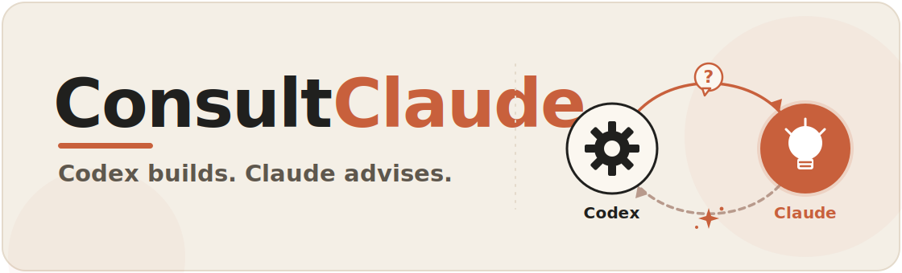

<p align="center">
  
</p>

<p align="center">
  <a href="https://github.com/Retro2512/ConsultClaude/actions/workflows/ci.yml"></a>
  <a href="LICENSE"></a>
  
  
  
</p>

<p align="center"><b>Codex has the hands. Claude has the ideas. ConsultClaude wires them together.</b></p>

---

ConsultClaude is a Codex plugin. It lets Codex hand the creative, planning-heavy parts of a job (design, copy, architecture, reviews) to your local Claude Code CLI automatically, while Codex stays the one writing the code and running the tests.

There's a longer take on [why that pairing works](#why-pair-codex-with-claude) further down.

## What you can ask Claude for

Pick a mode and Codex shapes the consultation for you:

| Mode | Ask Claude to |
| --- | --- |
| `design` | critique a screen or component before you build it |
| `layout` | rethink structure and information hierarchy |
| `creative` | brainstorm a few genuinely different directions |
| `copy` | sharpen product text, labels, and error messages |
| `logic` | stress-test an algorithm and its edge cases |
| `architecture` | weigh the tradeoffs on a design decision |
| `review` | give an independent second review of a change |
| `stress-test` | poke holes and surface failure modes |
| `quick` | a fast, low-cost gut check |
| `general` | anything that doesn't fit a box |

## What it looks like

You talk to Codex like you would a teammate:

```text
You    -> Codex:   "Before you build this settings screen, get Claude's take on the layout."
Codex  -> Claude:  asks in design mode, with the component as context
Claude -> Codex:   a direction, some alternatives, the risks
Codex  -> You:     builds the screen
```

In one line: you tell Codex, Codex asks Claude exactly what it needs, Claude advises, and Codex builds.

## Why pair Codex with Claude?

Codex and Claude are good at almost opposite things, and that's exactly why they work well together.

Codex understands you. Its models are technically strong, and they're good at reading a prompt and working out what you actually meant, even when the idea is rough, half-formed, or vibe-coded. What they're less good at is the creative leap: planning something from a blank page, picturing a direction, the parts of building that aren't just mechanical.

Claude is good at that leap. It's strong at creative planning and design thinking, and at taking a vague intention and turning it into something detailed and thought through. The trade-off runs the other way. Claude is weaker at reading a loose, under-specified idea. Give it a vague prompt on its own and it'll often do great work on the wrong reading of what you wanted.

So each model has the gap the other fills. The only missing piece is something to translate between them, and that's what ConsultClaude does.

You tell Codex what you want. Codex already gets your intent, so it turns that into a clear, specific question, the kind Claude needs in order to understand the idea properly, and asks it. Claude sends back a detailed plan or direction. Codex takes that and builds it.

Two things come out of that:

- You skip the manual back and forth. No drafting a plan in the Claude app, pasting it into Codex, hitting a gap, going back to Claude, and doing it all again. The whole consultation happens inside your Codex session.
- You get both strengths at once. Your idea gets understood and the creative output is strong, because each part is handled by the model that's better at it: the reading by Codex, the vision by Claude.

This matters most when you're vibe coding. You can stay loose and conversational with Codex about what you want, and still get the kind of deliberate, creative plan you'd normally have to drag out of Claude by hand.

## Install

**PowerShell (Windows):**

```powershell
irm https://raw.githubusercontent.com/Retro2512/ConsultClaude/main/install.ps1 | iex
```

**macOS / Linux:**

```bash
curl -fsSL https://raw.githubusercontent.com/Retro2512/ConsultClaude/main/install.sh | bash
```

Then start a fresh Codex thread so the new skill and tools load. The installer won't spend any Claude credits on its own.

<details>
<summary>Prefer to install by hand?</summary>

```bash
codex plugin marketplace add Retro2512/ConsultClaude --ref main
codex plugin add consultclaude@consultclaude
```

</details>

## What you need

- Codex CLI with plugin support. `codex plugin --help` should work.
- Python 3.10 or newer, available as `python`.
- Claude Code CLI, installed and signed in. `claude --version` should work.

ConsultClaude runs Claude on your own machine, through the CLI you already use. It doesn't bundle Claude, touch your Anthropic credentials, or send your context anywhere except that local CLI.

## What gets installed

- A Codex skill named `consultclaude`.
- Three local MCP tools: `consult_claude`, `consultclaude_presets`, and `consultclaude_doctor`.
- A dependency-free Python bridge around `claude --print`.

## Did it work?

Quick health check after install:

```bash
python path/to/installed/plugin/scripts/consultclaude_cli.py --doctor --output json
```

Want to confirm Claude can actually answer? The live check sends one small prompt with a `$0.10` budget cap:

```bash
python path/to/installed/plugin/scripts/consultclaude_cli.py --doctor-live --output json
```

## Staying safe

- The one-line installers run `codex plugin marketplace add` and `codex plugin add`. Want to read before you run? Open `install.ps1` or `install.sh` first.
- Don't hand Claude secrets, `.env` files, private keys, or whole-repo dumps.
- The bridge auto-redacts common token, key, bearer, JWT, Slack, GitHub, Google, AWS, and database-URL patterns from prompts, context, errors, and saved transcripts. That helps, but it's not a substitute for picking your context carefully.
- Claude only ever sees the prompt and context Codex hands it.

<details>
<summary>Advanced: pointing Claude at a specific cloud provider</summary>

By default, ConsultClaude uses whatever Claude Code already uses: Pro, Max, Team, Enterprise, Console/API, OAuth, all of it. No extra setup.

To force a provider route for the spawned Claude process, set `CONSULTCLAUDE_AUTH_PROVIDER` (or the `auth_provider` MCP/CLI field):

```bash
# Amazon Bedrock
export CONSULTCLAUDE_AUTH_PROVIDER=bedrock
export AWS_PROFILE=my-profile
export AWS_REGION=us-east-1
```

```bash
# Google Vertex AI
export CONSULTCLAUDE_AUTH_PROVIDER=vertex
export ANTHROPIC_VERTEX_PROJECT_ID=my-project
export CLOUD_ML_REGION=global
```

```bash
# Microsoft Foundry
export CONSULTCLAUDE_AUTH_PROVIDER=foundry
export ANTHROPIC_FOUNDRY_RESOURCE=my-resource
```

```bash
# Claude Platform on AWS
export CONSULTCLAUDE_AUTH_PROVIDER=anthropic-aws
export ANTHROPIC_AWS_WORKSPACE_ID=wrkspc_...
export AWS_REGION=us-east-1
```

Valid values: `default`, `bedrock`, `vertex`, `foundry`, `anthropic-aws` (the aliases `claude` and `anthropic` map to `default`). Keep secrets in environment variables or Claude Code settings, never in prompts.

**Gotcha:** if you want your subscription used but `ANTHROPIC_API_KEY` is set, Claude Code may quietly prefer the API key. Unset it, or check `claude /status`, if auth misbehaves.

</details>

<details>
<summary>Development & contributing</summary>

From the repo root:

```bash
python .github/scripts/validate_public_release.py
python plugins/consultclaude/scripts/consultclaude_cli.py --list-models --output json
```

Dry-run the bridge without needing Claude on `PATH`:

```bash
CONSULTCLAUDE_CLAUDE_PATH=python python plugins/consultclaude/scripts/consultclaude_cli.py --prompt "Smoke test" --dry-run --output json
```

PowerShell:

```powershell
$env:CONSULTCLAUDE_CLAUDE_PATH = "python"
python plugins/consultclaude/scripts/consultclaude_cli.py --prompt "Smoke test" --dry-run --output json
Remove-Item Env:\CONSULTCLAUDE_CLAUDE_PATH
```

`CONSULTCLAUDE_CLAUDE_PATH` can be a command name on `PATH` or a full path to an executable.

Repository layout:

```text
.agents/plugins/marketplace.json
plugins/consultclaude/.codex-plugin/plugin.json
plugins/consultclaude/.mcp.json
plugins/consultclaude/scripts/
plugins/consultclaude/skills/
plugins/consultclaude/skills/consultclaude/agents/
plugins/consultclaude/skills/consultclaude/references/
```

See [CONTRIBUTING.md](CONTRIBUTING.md) for the full setup, PR guidelines, and release checklist.

</details>

## Update & uninstall

```bash
# update
codex plugin marketplace upgrade consultclaude
codex plugin add consultclaude@consultclaude

# uninstall
codex plugin remove consultclaude
codex plugin marketplace remove consultclaude
```

Open a fresh Codex thread after updating.

## License

[MIT](LICENSE).
